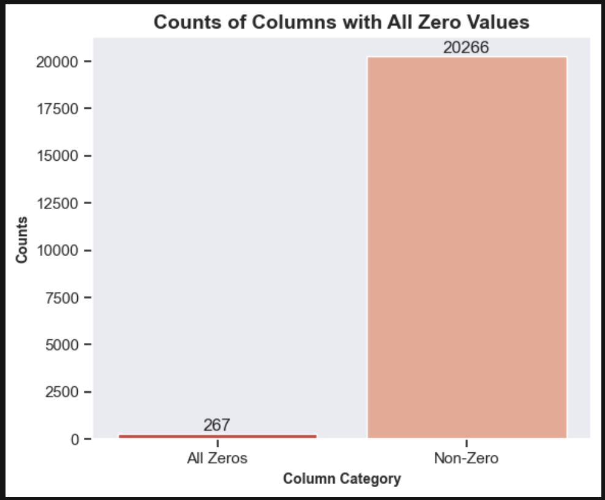

# Project Title: Tumor Classification Using RNA-Seq Gene Expression Profiles

## Project Description
The goal of this project is to analyze RNA-seq data taken from various cancer patients and implement classification models for the accurate indentification of tumor types. The project consists of comprehensive data analysis, exploration, pre-processing, and the application of classification algorithms. 

The data used for this project can be found here: https://archive.ics.uci.edu/dataset/401/gene+expression+cancer+rna+seq

### **Table of Contents**
  1. [Data Exploration](#data_exploration)
  2. [Data Pre-Processing](#data_preprocessing)
  3. [Classification Models](#classification_models)

#### 1. Data Exploration

The first step of my pipeline is to perform the EDA. This will give us a better understanding of the dataset we are working with. 

After merging the data file and the labels file, the resulting shape of the dataset is (801, 20533). Whether this dataset is deemed as "big data" is subjective and contingent on its intended use. In the context of gene expression data, the sheer volume of genes present in the human body, many of which may not be relevant to the specific case at hand, diminishes the perception of this dataset as big data. In reality, this amount of gene expression data represents only a fraction of what researchers typically encounter when profiling various diseases.

Once I gathered information on the dataset, the next step involved data exploration and cleanup. Here are the key aspects of the data exploration conducted:

**1. Checking and Handling Null Values:**

Fortunately, the dataset did not contain any null values.

**2. Handling Columns with Zero Values:**

In addition to checking for null values, an examination was conducted to identify columns with all zero values. While this step may not be necessary for every dataset, it was deemed essential in this context. The objective was to ascertain if there were any genes in the dataset with zero expression across all samples.

The visualization above illustrates the count of columns (genes) with all zero values and those with atleast one non-zero value, providing insights into the distribution of such genes in the dataset.

#### 2. Data Normalization 

  

#### 2. Classification Models